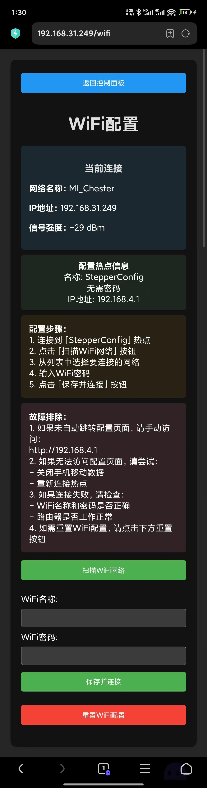
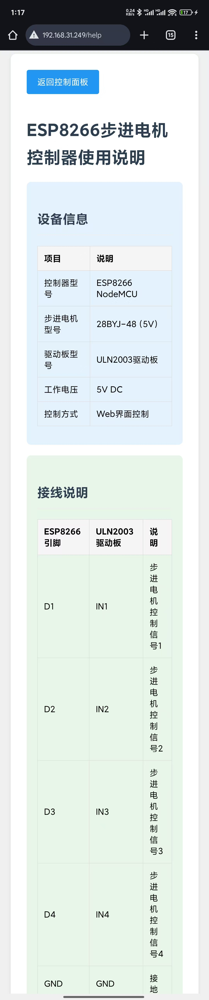

# ESP8266 步进电机 Web 控制器：让硬件控制更简单

> 基于 ESP8266 的开源项目，使用 ULN2003 驱动板控制 28BYJ-48 步进电机，通过网页实现精确控制

## 项目简介

这是一个让步进电机控制变得简单的开源项目。通过网页界面，您可以精确控制 28BYJ-48 五线四相步进电机的转动角度、圈数和速度。项目使用 ULN2003 达林顿阵列驱动板进行电机驱动，配合 ESP8266 NodeMCU 开发板实现 Web 控制。无需安装任何 APP，只需要一个浏览器就能实现专业级的电机控制。

### 硬件规格
- 步进电机：28BYJ-48（5V，4相5线制）
  - 减速比：1:64
  - 步距角：5.625° x 1/64
  - 额定电压：5V DC
  - 相数：4相
  - 驱动方式：单相励磁/双相励磁
  
- 驱动板：ULN2003 步进电机驱动板
  - 驱动芯片：ULN2003AN
  - 工作电压：5-12V DC
  - 驱动电流：最大500mA/相
  - 输入/输出接口：标准2.54mm接口
  - 指示灯：4个相位指示LED

### 为什么选择 Web 控制？
- 🌐 跨平台：支持所有带浏览器的设备
- 📱 无需安装：打开浏览器即可使用
- 🔄 实时控制：即时响应，状态实时反馈
- 🛠 易于配置：首次使用自动配置模式

## 界面展示

### 控制界面
#### PC 端主控制界面
> 清晰的布局设计，支持角度/圈数双模式控制，实时状态反馈


#### 移动端主控制界面
> 针对触控优化的响应式设计，操作更便捷


### 配置与帮助
#### WiFi 配置流程
1. PC端网络配置界面
> 支持WiFi扫描、连接和状态监控


2. 移动端首次配置界面
> 首次使用时的快速配置向导


3. 移动端网络管理界面
> 便捷的网络设置和状态查看


#### 使用帮助
1. PC端帮助页面
> 详细的使用说明和故障排除指南


2. 移动端帮助页面
> 适配移动设备的帮助文档


## 主要特性

### 1. 双模式控制
- ⚙️ 角度模式：0-360° 精确控制
- 🔄 圈数模式：1-50 圈可调
- 🎚️ 速度调节：1-15 RPM 范围内自由设定

### 2. 移动端优化
- 📱 响应式设计
- 👆 触控优化
- 📊 清晰的状态显示

## 硬件需求

### 基本配置
- ESP8266 NodeMCU 开发板
- 28BYJ-48 步进电机（5V）
- ULN2003 驱动板
- Micro USB 数据线
- 5V/1A 电源（推荐）

### 实物图和接线


### 接线对照表
| ESP8266 引脚 | ULN2003 驱动板 | 说明 |
|------------|---------------|------|
| D1         | IN1          | 控制信号 1 |
| D2         | IN2          | 控制信号 2 |
| D3         | IN3          | 控制信号 3 |
| D4         | IN4          | 控制信号 4 |
| GND        | GND          | 接地     |
| VU (5V)    | VCC          | 电源正极  |

## 使用指南

### 首次使用
1. 按照接线图连接硬件
2. 给设备通电
3. 用手机或电脑连接"StepperConfig" WiFi
4. 浏览器访问配置页面（自动弹出或访问 192.168.4.1）
5. 选择并配置您的 WiFi 网络

### 电机控制
1. 选择控制模式（角度/圈数）
2. 设置目标值和速度
3. 使用控制按钮（正转/反转/停止）
4. 查看实时状态反馈

## 技术实现

### 核心功能
- Web 服务器：ESP8266WebServer
- 电机控制：AccelStepper
- 配置存储：EEPROM
- 网络功能：ESP8266WiFi
- 自动配置：DNSServer (Captive Portal)

### 代码结构
```
step_runner/
├── 28BYJ-48 step_runner.ino    # 主程序
├── README.md                    # 说明文档
└── images/                      # 文档图片
```

## 常见问题

### 1. 电机不转动？
- ✔️ 检查电源供电（需要 5V/1A 以上）
- ✔️ 验证接线是否正确
- ✔️ 确认 WiFi 连接状态

### 2. 控制不精确？
- ⚡ 确保电源稳定
- 🏋️ 检查负载是否过重
- 🔄 尝试降低运行速度

### 3. 无法连接设备？
- 📱 关闭移动数据
- 🔄 重新连接 WiFi
- 🔍 确认设备 IP 地址

## 开源协议

本项目采用 MIT 协议开源，欢迎使用和改进。

---

> 注：请在使用前仔细阅读接线说明和注意事项，以免损坏硬件。
